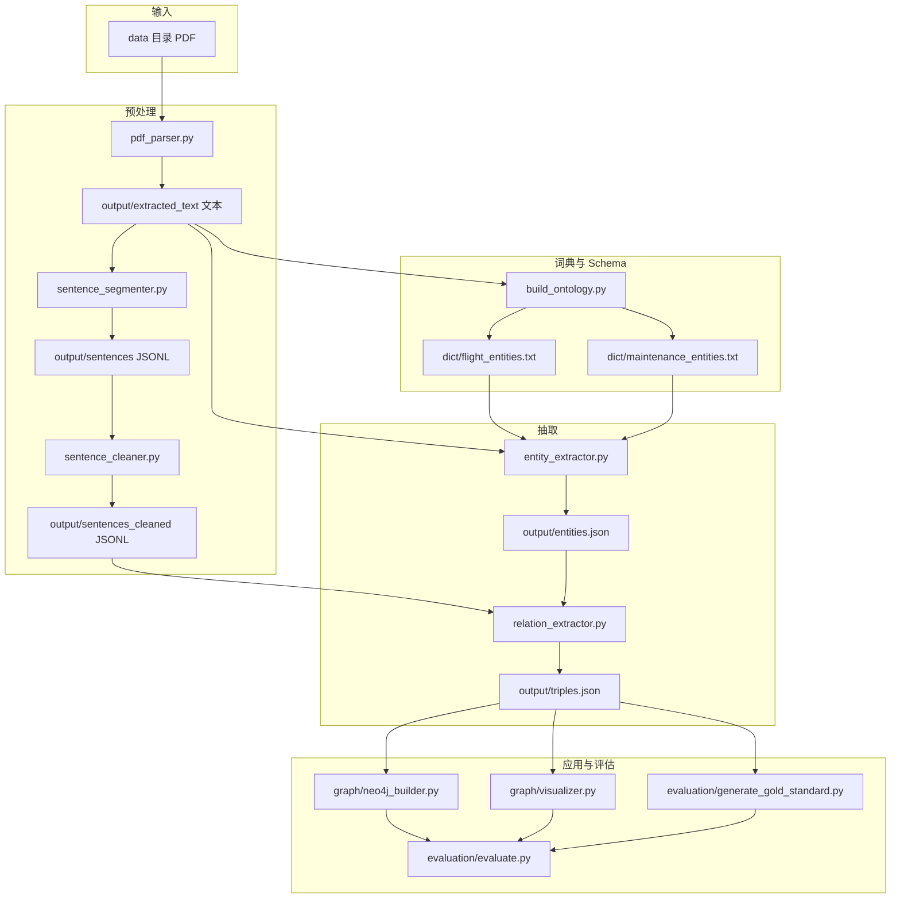

# 航空航天与装备维修领域知识图谱：技术报告

> 本文档按「背景与目标 → 系统架构 → 数据预处理 → Schema 与词典 → 实体抽取 → 关系抽取 → 存储与可视化 → 评估 → 工程细节 → 总结」组织

---

## 1. 项目背景与目标

### 1.1 项目背景

知识图谱以实体—关系—实体（或属性）三元组刻画领域概念及其关联。航空航天、变构飞行器与装备维修类资料多为 PDF，存在双栏排版、图表穿插、页眉页脚重复、文献角标、中英文标点混用、物理断行导致的字间空格等问题。若预处理与抽取策略不当，规则型关系抽取易出现**跨句配对、捕获窗口过长、证据句不可读**等现象。

### 1.2 数据集与语料约定

- **原始语料**：`data/` 目录（递归遍历子目录）中的 PDF。领域标签由路径关键字推断：`变构飞行器`、`飞行器`、`维修类`（见 `pdf_parser.get_domain_from_path`）。
- **可提取性**：本仓库 **仅对含足够文本层的 PDF 做 `get_text()` 提取**；对疑似扫描件（前若干页平均字符数过低）直接跳过，避免无文本层时的噪声或误报。
- **中间产物**：统一落在 `output/` 下，便于删除重建与答辩时展示「数据形态演变」。

### 1.3 课程/作业目标对齐

| 指标 | 常见要求 | 本仓库实现口径 |
|------|----------|----------------|
| 概念（实体）规模 | ≥ 500 | `entity_extractor.py` 基于用户词典 + 全文 jieba 扫描，词频 ≥ 2 过滤后写入 `output/entities.json` |
| 关系（三元组）规模 | ≥ 1000 | `relation_extractor.py`：`dict/patterns.json` 模板 +「A的B」+ 触发词共现（含**紧邻距离约束**），`output/triples.json` |
| 评估标注 | ≥ 200 概念、≥ 400 关系 | `evaluation/generate_gold_standard.py` 生成 `gold_annotations.json`；`evaluation/evaluate.py` 输出 `metrics_report.md` |
| 算法属性 | 非「纯 LLM 抽全量」 | 主链路为 **规则 / 词典 / 正则**；仓库不将 LLM 作为必需依赖 |

#### 1.3.1 课程要求与正式提交建议

- **规模自证**：实体数、三元组条数以运行后 `output/entities.json`、`output/triples.json` 内实际统计为准；答辩材料中建议附**一次完整跑数**的控制台摘要或小型统计脚本输出截图。  
- **评估与金标**：当前 `evaluation/generate_gold_standard.py` 为**协议化模拟金标准**（抽样 + 扰动 + 人工补充占位三元组），用于打通 `evaluate.py` 与 `metrics_report.md`。**正式提交/论文级表述**建议：逐步替换为 **Doccano、Brat** 等工具上的**真实人工标注**；在技术报告中单独写明**标注规范**（何算实体、何算关系、边界情况如何处理）及**一致性检验**（双人抽检比例、Cohen’s κ 等，视课程要求选用）。  
- **可追溯**：任意三元组应能回到 `evidence` 句与 `doc` 来源，与 `流程.md` 中强调的「溯源字段」一致。

### 1.4 方法论与技术路线

本仓库采用 **「Schema/词典可版本化 + jieba 分词与白名单 + 句内正则模板 + 结构化补充 + 受控共现增强」** 的可复现路线，各环节与脚本对应如下：

| 典型工程环节 | 本仓库实现 |
|--------------|------------|
| PDF 提取与清洗 | `pdf_parser.py`（PyMuPDF） |
| 分句预处理 | `sentence_segmenter.py` → `sentence_cleaner.py` |
| 词典挖掘 | `build_ontology.py`（`dict/flight_entities.txt`、`dict/maintenance_entities.txt`） |
| 实体抽取 | `entity_extractor.py`（`schema/schema.json` 类型启发式） |
| 关系抽取 | `relation_extractor.py`（运行时加载 **`dict/patterns.json`**） |
| 三元组落盘与可视化 | `output/triples.json`、`graph/visualizer.py`（3D） |
| 图数据库 | `graph/neo4j_builder.py` |
| 评估 | `evaluation/generate_gold_standard.py`、`evaluation/evaluate.py` |

**工程形态说明**：本仓库以**分脚本顺序执行**为主（见第 9 节），未捆绑单一入口脚本，便于单步调试与答辩演示；可视化侧重 **3D Force Graph** 独立 HTML。若需 Web 查询或命令行问答，可在现有 `triples.json` / Neo4j 之上另行扩展。

---

## 2. 系统架构

### 2.1 整体数据流



### 2.2 本仓库目录与职责

> 以下采用「路径 # 作用」；**脚本**为可执行入口，**output/** 为运行生成物，可整夹删除后按第 2.3 节顺序重跑。

```
KnowledgeGraph/
├── data/                                    # 原始 PDF 语料（递归读取）；不参与流水线改写
├── output/                                  # 中间结果与最终图谱数据（默认目录名）
│   ├── extracted_text/                      # pdf_parser：逐文档纯文本
│   │   ├── *.txt                            # 单篇清洗后正文（文件名含领域前缀）
│   │   └── catalog.json                     # 各 PDF 处理状态、领域、字符量等编目信息
│   ├── sentences/                           # sentence_segmenter：分句 JSONL（字段 doc、sentence）
│   ├── sentences_cleaned/                  # sentence_cleaner：去角标/全角化等后的 JSONL；关系抽取输入
│   ├── entities.json                        # entity_extractor：实体 id、类型、词频、来源文档列表
│   ├── triples.json                         # relation_extractor：三元组及 evidence、doc 溯源字段
│   └── graph_3d.html                       # graph/visualizer：三维力导向图谱 HTML（浏览器打开）
├── dict/                                    # 词典与句内关系模板（建议纳入版本管理）
│   ├── flight_entities.txt                  # jieba 用户词典：飞行器/变构域（挖掘或人工修订）
│   ├── maintenance_entities.txt             # jieba 用户词典：维修域（挖掘或人工修订）
│   └── patterns.json                        # relation_extractor 加载：正则模板列表（顶层 key 为 patterns）
├── schema/
│   └── schema.json                          # entity_extractor 参考：实体类型 label/examples/description
├── graph/
│   ├── neo4j_builder.py                     # 将 triples.json MERGE 导入 Neo4j（需服务与账号配置）
│   └── visualizer.py                        # 由 triples.json 统计子图并写出 graph_3d.html
├── evaluation/
│   ├── generate_gold_standard.py            # 从 triples 抽样生成或更新 gold_annotations.json（评测协议可配置）
│   ├── evaluate.py                          # 金标与预测对比，终端输出 P/R/F1 并写 metrics_report.md
│   ├── gold_annotations.json                # 金标准三元组（字段与抽取结果对齐，供 evaluate 读取）
│   └── metrics_report.md                    # 评测报告：指标表、混淆项与结论说明
├── lib/                                     # 浏览器端可视化静态依赖（扩展 2D/检索界面时使用）
│   ├── bindings/utils.js                    # 与 vis 等库配套的辅助逻辑
│   ├── vis-9.1.2/                           # vis-network 压缩包与样式
│   └── tom-select/                          # 下拉选择组件（若做 Web 筛选 UI）
├── pdf_parser.py                            # PDF 文本层提取、扫描件判定、写 extracted_text 与 catalog
├── build_ontology.py                        # 从语料挖掘两本用户词典；可选 --write-schema-patterns 写 schema/patterns
├── sentence_segmenter.py                    # 全文 → 分句 JSONL
├── sentence_cleaner.py                    # 分句 JSONL → 清洗后 JSONL
├── entity_extractor.py                    # 用户词典 + jieba 扫描 → entities.json
├── relation_extractor.py                  # patterns + 实体表 + 清洗句 → triples.json
├── 知识图谱完整技术报告.md                  # 本报告：背景、方法、实验与复现说明（提交/答辩正文）
```

#### 2.2.1 文档与报告类文件一览

**（1）Markdown 文档（`.md`）**

| 文件 | 作用 |
|------|------|
| `知识图谱完整技术报告.md` | 技术报告正文：背景、架构、各阶段算法、评估口径与工程细节 |
| `流程.md` | 一页式「脚本执行顺序 + 产出路径 + 数据约定」索引，与本文档互为补充 |
| `视频讲解稿.md` | 结课讲解视频的分镜时间轴、口播稿与录屏注意事项 |
| `task.md` | 课程大作业要求摘录（实体/关系规模、评估、提交与截止时间等），便于对照评分表 |
| `explore.md` | 开题与路线讨论备忘，记录前期技术选型与任务拆解，非答辩必读 |
| `evaluation/metrics_report.md` | 由 `evaluate.py` 覆盖写入的评测报告：P/R/F1、混淆项与结论段落 |
| `.rules/skill.md` | 编辑器或 Agent 辅助规则备忘；提交作业压缩包时可按需排除 |

**（2）关键 JSON / HTML 产出（非脚本，承担「数据说明」角色）**

| 文件 | 作用 |
|------|------|
| `output/catalog.json` | `pdf_parser` 写出：每份 PDF 是否成功提取、跳过原因、领域与字符量等 |
| `output/entities.json` | `entity_extractor` 写出：实体 id、类型、词频与来源文档，供关系抽取与 Neo4j 使用 |
| `output/triples.json` | `relation_extractor` 写出：全量三元组及 `evidence`、`doc` 字段，供可视化、图库与评测 |
| `evaluation/gold_annotations.json` | `generate_gold_standard.py` 生成：`evaluate.py` 读取的金标准三元组集合 |
| `output/graph_3d.html` | `graph/visualizer.py` 生成：浏览器内可交互的 3D 力导向子图展示 |

各 `.py` 脚本内可通过模块文档字符串或注释查看入口用法；与上表重复的「脚本职责」仍以 §2.2 目录树为准。

依赖说明：若仓库根目录提供 `requirements.txt`，则用于声明 Python 第三方库版本；当前以本地已安装环境为准时，可在该文件中补充 PyMuPDF、jieba、neo4j 等条目后再行 `pip install -r requirements.txt`。

### 2.3 全流程执行清单与产出物

| 序号 | 动作 | 脚本 | 主要产出 | 前置依赖（简要） |
|:---:|:---|:---|:---|:---|
| 1 | PDF → 纯文本 | `pdf_parser.py` | `output/extracted_text/*.txt`、`catalog.json` | `data/` 下已放置 PDF |
| 2 | 挖掘领域词典（可选写 schema/patterns） | `build_ontology.py` | 默认：`dict/flight_entities.txt`、`dict/maintenance_entities.txt`；`--write-schema-patterns` 时可写 `schema/schema.json`、`dict/patterns.json` | 步骤 1 已产生 `extracted_text` |
| 3 | 全文分句 | `sentence_segmenter.py` | `output/sentences/*.jsonl` | 步骤 1 |
| 4 | 句子清洗 | `sentence_cleaner.py` | `output/sentences_cleaned/*.jsonl` | 步骤 3 |
| 5 | 实体抽取 | `entity_extractor.py` | `output/entities.json` | 步骤 1 + 步骤 2（词典） |
| 6 | 关系抽取 | `relation_extractor.py` | `output/triples.json` | 步骤 4 + 步骤 5；**运行时加载 `dict/patterns.json`** |
| 7 | 3D 可视化（可选） | `graph/visualizer.py` | `output/graph_3d.html` | 步骤 6 |
| 8 | Neo4j 入库（可选） | `graph/neo4j_builder.py` | 本地图库 | 步骤 6；Neo4j 服务与连接配置 |
| 9 | 金标准 + 评测 | `evaluation/generate_gold_standard.py` → `evaluation/evaluate.py` | `evaluation/gold_annotations.json`、`evaluation/metrics_report.md` | 步骤 6 |

**与纯文档索引的差异**：本报告在第 3～8 节对各步骤给出**参数级、逻辑级**说明。

### 2.4 目录与数据约定

- **原始语料**：一律从 `data/` **递归**发现 PDF（与 `pdf_parser` 一致）。  
- **中间态**：一律写入 `output/`，便于 `rm -r output` 或整夹删除后**无损重跑**全链路，也方便用文件 diff 观察各阶段语料形态变化。  
- **关系模板**：`dict/patterns.json` 由 `relation_extractor.py` **运行时加载**；修改正则后应单句抽样回归，确认与 `sentence_cleaner` 全角化后的语料一致，避免捕获窗口过长导致假匹配。

---

## 3. 数据预处理

本阶段目标：从 PDF 得到**单句隔离、尽量干净**的文本，使后续正则只在句内匹配，并与实体表对齐。

### 3.1 PDF → 纯文本（`pdf_parser.py`）

#### 3.1.1 目的与策略

- **目的**：优先使用 PDF **文本层**（PyMuPDF `fitz`），在疑似纯扫描件时**整文件跳过**，避免 OCR 未启用时的空文或乱抽。
- **判据说明**：业界常见做法有「按前若干页平均字符数判定是否具备可抽取文本层」等；本仓库实现为：抽样 **`min(10, 页数)`** 页，计算平均每页字符数，**阈值 `MIN_TEXT_AVG = 50`**（见代码常量），在「尽量少误判电子版为扫描件」与「避免对纯图片 PDF 空转」之间折中。

#### 3.1.2 逐步操作（与代码一致）

| 步骤 | 行为 | 说明 |
|:----:|------|------|
| 1 | 遍历 `DATA_DIR` 下所有 `.pdf` | `os.walk` |
| 2 | 输出文件名 | `{领域}_{安全文件名}.txt`，空格替换为 `_` |
| 3 | **缓存跳过** | 若目标 `.txt` 已存在，则跳过该 PDF（加速重复运行） |
| 4 | `is_text_pdf` | 前 `n` 页 `get_text()` 总字符 / `n` ≤ 50 → 记为扫描倾向，写入 `catalog.json` 的 `scanned_skipped` |
| 5 | `process_pdf` | 逐页拼接非空 `page.get_text()` |
| 6 | `clean_text` | 去独立页码行样式；中文间断行合并；压缩多余换行与连续空格 |
| 7 | 写盘与编目 | `output/extracted_text/*.txt` + `catalog.json`（成功含 `chars`） |

**输入**：`data/**/*.pdf`  
**输出**：`output/extracted_text/*.txt`、`output/extracted_text/catalog.json`  
**命令**：`python pdf_parser.py`

#### 3.1.3 异常与工程注意

- 解析异常记入 `catalog` 的 `error` 状态，并在控制台打印。
- **扫描件**：当前仓库未接入 OCR 分支；若需覆盖扫描 PDF，应单独增加「渲染页面 + OCR」流水线，并在报告中说明与文本层分支的切换条件。

---

### 3.2 全文 → 句子 JSONL（`sentence_segmenter.py`）

#### 3.2.1 目的

将每篇提取文本拆成**带文档名的句子记录**，为下游提供稳定字段 `doc` / `sentence`。

#### 3.2.2 逐步操作

| 步骤 | 行为 |
|:----:|------|
| 1 | `glob`：`output/extracted_text/**/*.txt`（**含子目录**） |
| 2 | 断句 | 在 `。！？；!?;\n` 后插入换行，再按行切分 |
| 3 | 过滤 | `strip` 后长度 **> 3** 的句子保留（与代码一致；注意不是 ≥ 6） |
| 4 | 写 JSONL | 每行 `{"doc": "<basename>", "sentence": "<句>"}` |

**输入**：`output/extracted_text/*.txt`  
**输出**：`output/sentences/<doc>.jsonl`  
**命令**：`python sentence_segmenter.py`

---

### 3.3 句级深度清洗（`sentence_cleaner.py`）

#### 3.3.1 目的

在正则匹配前消除：文献角标、图表引导括号、半角标点、PDF 字间空格。该步骤与 `dict/patterns.json` 中「全角句读」假设一致。

#### 3.3.2 逐步操作（函数 `clean_sentence`）

| 顺序 | 规则 | 典型目的 |
|:----:|------|----------|
| 1 | `\[ \d+ ... \]` | 去除 `[12]`、`[1-3]`、`[1, 2]` 等引用角标 |
| 2 | `（如图…）`、`(见表…)` 等 | 去除图表引导性括号片段 |
| 3 | 半角标点映射为全角 | `, ( ) : ; ? !` → 中文标点 |
| 4 | `re.sub(r'\s+', '', text)` | **全局去除空白**（含字间空格）；英文词可能被粘连——本管线以中文教材/论文为主 |

| 步骤 | 行为 |
|:----:|------|
| 读入 | `output/sentences/*.jsonl` |
| 过滤 | 清洗后长度仍 **> 3** 才写出 |
| 写出 | `output/sentences_cleaned/*.jsonl`，字段仍为 `doc` / `sentence` |

**命令**：`python sentence_cleaner.py`

### 3.4 句子级降噪的设计意图

1. **文献角标** `\[[0-9,\-\s]+\]`：若不删，正则捕获组容易把角标吞进实体边界，或造成断词。  
2. **图表引导括号**（如「（如图…）」）：对关系语义贡献低，却会占用捕获窗口，删除后可让模式更稳定地落在陈述句主干上。  
3. **标点全角化**：`dict/patterns.json` 大量模式以中文全角句读 `，`。；！？` 等为边界假设；若语料半角标点混杂，**未清洗则命中率下降**。  
4. **全局去空白**：针对 PDF 物理断行产生的字间空格；代价是英文词可能粘连，故本管线默认语料以**中文叙述**为主。  

整体上，该模块与关系抽取中的 **`_clean_entity_name` + `find_entity`** 形成两级护栏：前者在字符级规整句子，后者在对齐实体时二次剔除数字与图序残留。

---

## 4. Schema 与词典构建

### 4.1 设计原则（领域适用性）

- **飞行器侧**：偏层级——整机 → 部件/气动布局 → 参数/材料/技术。  
- **维修侧**：偏因果与操作链——元件 → 故障/现象 → 维修动作 → 工具/设备。  
- **可版本化**：机器可读类型与类型说明集中在 `schema/schema.json`，作为实体分类与报告撰写的统一依据。

### 4.2 本体说明与词典挖掘（`build_ontology.py`）

#### 4.2.1 子步骤

| 步骤 | 函数/块 | 产出 |
|:----:|---------|------|
| 1 | `auto_mine_entities` | 读取 `output/extracted_text/*.txt`，文件名含「维修」并入维修域，否则并入飞行器与变构域 |
| 2 | TF-IDF 关键词 | `jieba.analyse.extract_tags`，`allowPOS` 限定名词类；`stop_words` 过滤通用词；长度 > 1 |
| 3 | 写 jieba 用户词典 | `dict/flight_entities.txt`、`dict/maintenance_entities.txt`，行格式：`词条 100 n` |

**命令**：

- 日常仅更新挖掘词典（**不覆盖**已手工维护的 `schema/schema.json`、`dict/patterns.json`）：`python build_ontology.py`
- 需要由脚本**生成或覆盖** schema 与 patterns 时：`python build_ontology.py --write-schema-patterns`；若已存在英文版 schema 或较多 patterns 规则仍要强制覆盖，加 `--force`。

#### 4.2.2 与 `entity_extractor.py` 的衔接

- `entity_extractor` **只加载** `flight_entities.txt` 与 `maintenance_entities.txt` 作为 **jieba 用户词典 + 白名单**。
- 细粒度英文类型标签（如 `Aircraft`、`HydraulicComponent`）由 `determine_entity_type` 结合 `schema/schema.json` 的键空间启发式给出（见第 5 节）。

### 4.3 关系模板（`dict/patterns.json`）

| 文件 | 角色 |
|------|------|
| `dict/patterns.json` | **运行时**由 `relation_extractor.py` 加载；正则多为 **1～25 字短窗口** `[^，。；！？]{1,25}`，用于抑制贪婪匹配；修改后建议单句抽样回归验证。 |

### 4.4 迭代词典与 Schema 时的工程习惯

推荐工作方式如下：

1. **改词典**：直接编辑或在语料更新后重跑 `build_ontology.py` 覆盖 `flight_entities.txt` / `maintenance_entities.txt`，再重跑 `entity_extractor.py` 观察 `entities.json` 规模与类型分布。  
2. **改关系规则**：在副本上编辑 `patterns.json`，单句抽样跑 `relation_extractor`，用 `evidence` 人工 spot-check；确认无误后再替换主分支文件。  
3. **Schema 与类型**：**类型推断与类型说明**以 `schema/schema.json` 与 `determine_entity_type` 为准，与词典、三元组中的类型字段保持一致即可。

---

## 5. 实体抽取（流程化详述）

**脚本**：`entity_extractor.py`  
**产出**：`output/entities.json`

### 5.1 总体流程

```
加载 schema/schema.json（entity_types 键）
  → jieba.load_userdict(飞行/维修词典)
  → 从词典行解析白名单集合 valid_entities
  → glob(output/**/*.txt) 全文读取
  → jieba.cut 逐词命中 valid_entities
  → 累计 frequency 与 source_docs
  → 词频 >= 2 过滤
  → 按词频排序输出 ENT_xxxx
```

### 5.2 逐步操作说明

| 步骤 | 代码逻辑 | 说明 |
|:----:|----------|------|
| 1 | `load_schema_entity_types` | 读取 `schema/schema.json`；类型推断主要依据词面规则，Schema 作语义约束参考 |
| 2 | 用户词典 | 两个 `dict/*.txt` 全部 `load_userdict` |
| 3 | 白名单 | 词典每行首列词，`len(word) > 1` 进入 `valid_entities` |
| 4 | 语料范围 | `glob(os.path.join(DATA_OUT_DIR, "**", "*.txt"), recursive=True)` — **含** `extracted_text` 下全部 txt |
| 5 | 分词扫描 | `jieba.cut(text)`，`word in valid_entities` 则 `frequency += 1`，`docs` 记录 basename |
| 6 | 类型 | `determine_entity_type(word, ...)`：按后缀/子串规则映射到 `Component`、`Aircraft`、`Parameter` 等；未命中 → `Concept` |
| 7 | 过滤与排序 | `frequency >= 2`；按 `frequency` 降序 |
| 8 | ID | `ENT_0001` 起递增 |

### 5.3 词典方案与可扩展通道

- **当前主路径**：jieba + 用户词典驱动，强调领域词不被切碎；实体规模主要由 **TF-IDF 挖掘词表 + 词频 ≥ 2 过滤** 控制。  
- **可扩展方向**（按需增量开发）：针对数值型参数、装备型号等可增加**正则或规则通道**；实体规模不足时可**放宽词频阈值**、**扩充/人工修订 `dict/*.txt`**，或引入**受控词典扩展**（带类型与来源标注，避免无节制灌入通用词）。

### 5.4 实现过程记录：实体模块在开发中的定案要点

1. **分词干预**：`jieba.load_userdict` 依次加载 `flight_entities.txt` 与 `maintenance_entities.txt`，使「变构飞行器」「液压换向阀」等长词尽量整词进入 `jieba.cut` 输出，避免被切成碎片后无法与 `valid_entities` 精确匹配。  
2. **实体分类**：`determine_entity_type` 不调用外置模型，而用**可读的词缀/子串规则**映射到 `schema.json` 风格的英文类型标签；无法命中时落到 `Concept`，保证 Neo4j 侧标签总存在。  
3. **全文扫描**：在 `output/**/*.txt` 上统计（含各子目录提取结果），保证词频与 `source_docs` 反映**全书级**分布，而非仅某一句。  
4. **防重与过滤**：同一词在 jieba 输出中多次出现则累加频次；输出前 **`frequency >= 2`** 去掉偶发噪声；`id` 采用 `ENT_xxxx` 稳定编号，便于与 `triples.json` 中外键式引用对齐。  
5. **与关系模块契约**：实体名表是关系抽取的**白名单边界**；任何未进入 `entities.json` 的字符串，即使用正则捕获到也不会形成合法三元组，这是**刻意为之的精度优先策略**。

---

## 6. 关系抽取（流程化详述）

**脚本**：`relation_extractor.py`  
**输入**：`output/entities.json`、`dict/patterns.json`、`output/sentences_cleaned/*.jsonl`  
**输出**：`output/triples.json`（含 `evidence`、`doc`）

整体由三层策略串联，**共用** `seen_triples` 集合，键为 `(source_id, relation, target_id)` 做全局去重。

### 6.1 层 L1：`patterns.json` 模板正则

#### 6.1.1 预处理

| 步骤 | 行为 |
|:----:|------|
| 1 | 构建 `entity_dict[name] -> 记录` |
| 2 | `entity_names_sorted`：实体名 **按长度降序**（长词优先，减轻子串误匹配） |
| 3 | 预编译每条 `regex`；编译失败则打印并跳过 |

#### 6.1.2 句内匹配与对齐

对每条清洗句 `sentence`：

| 步骤 | 行为 |
|:----:|------|
| 1 | `finditer` 每条模式 |
| 2 | 取捕获组 `group(1)`、`group(2)` 为候选片段 |
| 3 | `_clean_entity_name`：去前导数字/标点、去尾标点；若匹配 `图/表/章节号` 形态则返回 `None` |
| 4 | `find_entity`：先要求清洗后片段 **完全等于**某实体名；否则在「片段近似等长于某实体名」条件下做**受控子串对齐**（容忍至多 2 字杂质，见代码） |
| 5 | 方向 | 若 `group1`/`group2` 标记为 `target`/`source`，则交换头尾 |
| 6 | 关系细化 | 若模式给出 `RELATED_TO`，则尝试 `infer_relation_type(source_type, target_type)` 替换为更具体类型（如 `has_component`） |
| 7 | 去重 | `seen_triples` |

**工程说明**：`_clean_entity_name` 与 `find_entity` 配合，用于削弱正则捕获到的**数字前缀、句读残留、图序/表序碎片**等对实体对齐的干扰。

### 6.2 层 L2：「A的B」所有格补充

| 项目 | 内容 |
|------|------|
| 正则 | `([^，。；！？\n]{2,10})的([^，。；！？\n的]{2,10})` |
| 条件 | 两端均 `find_entity` 成功且不等同 |
| 关系 | `infer_relation_type`；若仍为 `RELATED_TO` **则不写入**（避免「的」字结构泛滥） |
| 去重 | 同上 `seen_triples` |

### 6.3 层 L3：触发词共现增强（带距离硬约束）

**触发**：句内出现 `导致|影响|位于|应用|作用于|结合|集成|匹配` 之一。

| 步骤 | 行为 |
|:----:|------|
| 1 | 枚举句中出现的实体名（按长度降序表扫描） |
| 2 | 子串剔除 | 若短词已落在更长命中词内部，则丢弃短词（避免重复节点） |
| 3 | 实体对组合 | 对 `found_ents` 做两两组合 |
| 4 | 触发映射 | `导致/影响/作用于` → `AFFECTS`；`位于` → `LOCATED_IN`；`应用/结合/集成/匹配` → `APPLIES`；再可被 `infer_relation_type` 细化 |
| 5 | **距离约束** | 取两实体首次出现下标，计算 `distance`（代码中在首尾相对位置下减去一侧实体长度）；要求 **`distance` 落在 `(0, 1]` 的紧邻型区间**，否则丢弃该对 |
| 6 | 触发兜底规模 | 当 `len(extracted_triples) < 1500` 时才进入该分支（代码中的召回增强开关） |

### 6.4 类型推断矩阵 `infer_relation_type`（摘录）

代码中显式定义的典型规则（节选，完整见源码）：

| (source_type, target_type) | 关系 |
|----------------------------|------|
| Aircraft, Component | has_component |
| Aircraft, Engine | powered_by |
| Aircraft, Parameter | has_parameter |
| Component, Material | uses_material |
| HydraulicComponent, Fault | has_fault |
| Fault, Maintenance | repaired_by |
| （未命中） | RELATED_TO |

### 6.5 三元组字段（「构建与清洗」在本仓库的落点）

**去重、证据绑定、方向修正**均在 `relation_extractor.py` 完成。每条三元组建议关注字段：

- `source_id` / `target_id`、`source_name` / `target_name`、`source_type` / `target_type`
- `relation`
- `evidence`：完整清洗句，用于答辩溯源
- `doc`：来源文档 basename（L3 分支使用 record 内 `doc`）

### 6.6 实现过程记录

1. **分句隔离**：只对 `output/sentences_cleaned/*.jsonl` 逐行处理，**禁止跨句**拼接后再匹配，从数据结构上消除「远距离实体乱配对」的主要诱因。  
2. **模板匹配**：启动时将 `patterns.json` 内每条 `regex` **预编译**；对每句 `finditer`，仅消费**两个捕获组**作为候选 span，避免不可控的多组回溯。  
3. **实体回填**：实体名列表按长度降序；片段经 `_clean_entity_name` 后再 `find_entity`；**对齐失败即丢弃该次匹配**，不以模糊猜测硬造节点，从而抑制「边界杂质」导致的伪实体。  
4. **兜底共现**：仅在模板+A的B 仍不足以满足规模或连通性时，由触发词分支补足；且带**字符间距硬约束**与「长词覆盖短词」规则，用于压制无触发语义支撑的假共现。  
5. **溯源**：每条记录强制携带 **`evidence`（整句）** 与 **`doc`（篇名）**，满足大作业对「可解释抽取」的展示需求，并便于事后审计错误 case。

---

## 7. 存储、可视化与应用

### 7.1 Neo4j 入库（`graph/neo4j_builder.py`）

| 步骤 | 行为 |
|:----:|------|
| 1 | 读取 `output/triples.json` |
| 2 | `DETACH DELETE` 清空图（默认每次全量重建） |
| 3 | 对预置实体类型列表逐类 `CREATE CONSTRAINT IF NOT EXISTS ... REQUIRE n.name IS UNIQUE`（失败则打印提示） |
| 4 | 批量 `MERGE (s:SourceType {name})-[r:`REL`]->(t:TargetType {name})`，关系类型名与 JSON 中 `relation` **动态一致** |

**配置**：在源码中修改 `NEO4J_URI`、`NEO4J_USER`、`NEO4J_PASSWORD` 以匹配本地实例（勿将真实密码提交至公共仓库）。  
**命令**：`python graph/neo4j_builder.py`

### 7.2 三维力导向可视化（`graph/visualizer.py`）

| 步骤 | 行为 |
|:----:|------|
| 1 | 统计节点在三元组中的出现频次 |
| 2 | 取 Top `max_nodes`（默认 1000）实体构成子图 |
| 3 | 生成嵌入 **3d-force-graph**（CDN）的 `output/graph_3d.html` |
| 交互 | 滚轮缩放、左键旋转、右键平移、点击节点相机飞行靠近 |

**命令**：`python graph/visualizer.py`

### 7.3 本仓库的展示与查询形态

当前以 **Neo4j Browser 的 Cypher 查询 + 3D HTML 浏览**（`graph_3d.html`）为主展示路径，数据层可直接消费 `output/triples.json`。）


---


## 8. 评估系统（流程化详述）

### 8.1 金标准生成（`evaluation/generate_gold_standard.py`）

| 步骤 | 参数/行为 |
|:----:|----------|
| 1 | 读取 `output/triples.json` |
| 2 | `random.seed(42)`，`sample_size = min(len(triples), 600)` **无放回抽样** |
| 3 | 对每条以 **10%** 概率将 `relation` 扰动为 `RELATED_TO`（模拟标注或专家修正与系统不一致） |
| 4 | 追加 **50** 条「专家补充」三元组（头尾实体名为 `专家补充实体_iA/B`），模拟系统未召回，用于产生 **FN** |
| 5 | 写出 `evaluation/gold_annotations.json` |

**说明**：此为**可复现的协议化模拟金标准**，用于打通评估脚本；正式学术评测应替换为 **Doccano / Brat** 等工具上的真实标注，并保持字段结构兼容。

### 8.2 指标计算（`evaluation/evaluate.py`）

#### 8.2.1 集合定义

- `set_pred`：预测三元组集合 `(source_name, relation, target_name)`
- `set_gold`：金标准三元组集合（同上三元组形式）

#### 8.2.2 混淆矩阵（边界封闭 FP）

| 符号 | 计算 |
|------|------|
| TP | `set_pred ∩ set_gold` 的大小 |
| FN | `|set_gold| - TP`（金标中有而预测未命中） |
| FP | 对每条预测 `(s, r, t)`：若 `(s, t)` 属于金标准中出现过的实体对集合 `gold_pairs`，且 `(s, r, t)` 不在金标准中，则计为 FP。即 **仅在金标准覆盖的实体子图内**惩罚关系标签错误，不对域外海量预测一律计 FP（见脚本注释） |

#### 8.2.3 指标与产出

- Precision、Recall、F1 标准公式；控制台打印；覆盖写入 `evaluation/metrics_report.md`。

**命令**：`python evaluation/generate_gold_standard.py` → `python evaluation/evaluate.py`

### 8.3 当前一次运行下的指标快照（以脚本为准）

以现有 `metrics_report.md` 中数值为准（重新运行 `evaluate.py` 会随 `triples.json` 与金标协议变化）：

| 指标 | 数值 |
|------|------|
| Precision | 78.64% |
| Recall | 83.85% |
| F1 | 81.16% |

---

## 9. 工程实现细节

### 9.1 一键复现顺序（本仓库）

依赖见 `requirements.txt`（含 PyMuPDF、jieba、neo4j 驱动等）。建议顺序：

1. `python pdf_parser.py`  
2. `python build_ontology.py`（可选：`python build_ontology.py --write-schema-patterns` 写入 schema/patterns）  
3. `python sentence_segmenter.py`  
4. `python sentence_cleaner.py`  
5. `python entity_extractor.py`  
6. `python relation_extractor.py`  
7. `python graph/visualizer.py`（可选）  
8. `python graph/neo4j_builder.py`（需本地 Neo4j 与正确配置）  
9. `python evaluation/generate_gold_standard.py` → `python evaluation/evaluate.py`  

### 9.2 容错与缓存

- **PDF 输出已存在**：`pdf_parser` 跳过重复提取。  
- **Neo4j 连接失败**：`neo4j_builder` 捕获异常并提示检查服务与账号，不阻断其他离线产物。  
- **正则编译失败**：单条模式跳过并打印原因，其余模式继续。

## 10. 总结与展望

### 10.1 项目特点

- **可解释**：模板、「的」字结构、触发词均有明确语言学动机；`evidence` 支持溯源。  
- **可复现**：确定性脚本 + 固定随机种子（金标生成）。  
- **结构清晰**：章节与数据流、脚本命名一一对应，便于评阅与复现。

### 10.2 局限与改进方向

1. **扫描件**：当前跳过；可引入 OCR + 版面分析与文本层双轨。  
2. **实体通道较单一**：可补充「参数/型号」等**规则通道**与**受控词典扩展**，与现有 TF-IDF 词表形成互补。  
3. **关系共现**：L3 使用极强紧邻约束，召回与精度权衡可改为可配置阈值。  
4. **评估**：将模拟金标替换为真实人工标注，并报告分领域、分句式指标。  
5. **应用层**：按需增加 Web 或命令行查询界面，与现有 JSON/Neo4j 数据源对接。

---

## 附录 A：核心文件索引

| 阶段 | 路径 |
|------|------|
| PDF 提取 | `pdf_parser.py` |
| 词典 / Schema 与 patterns（可选） | `build_ontology.py` |
| 分句 | `sentence_segmenter.py` |
| 句清洗 | `sentence_cleaner.py` |
| 实体 | `entity_extractor.py` |
| 关系 | `relation_extractor.py` |
| 运行时正则库 | `dict/patterns.json` |
| 三元组 | `output/triples.json` |
| Neo4j | `graph/neo4j_builder.py` |
| 3D 展示 | `graph/visualizer.py` |
| 评估 | `evaluation/generate_gold_standard.py`、`evaluation/evaluate.py` |
